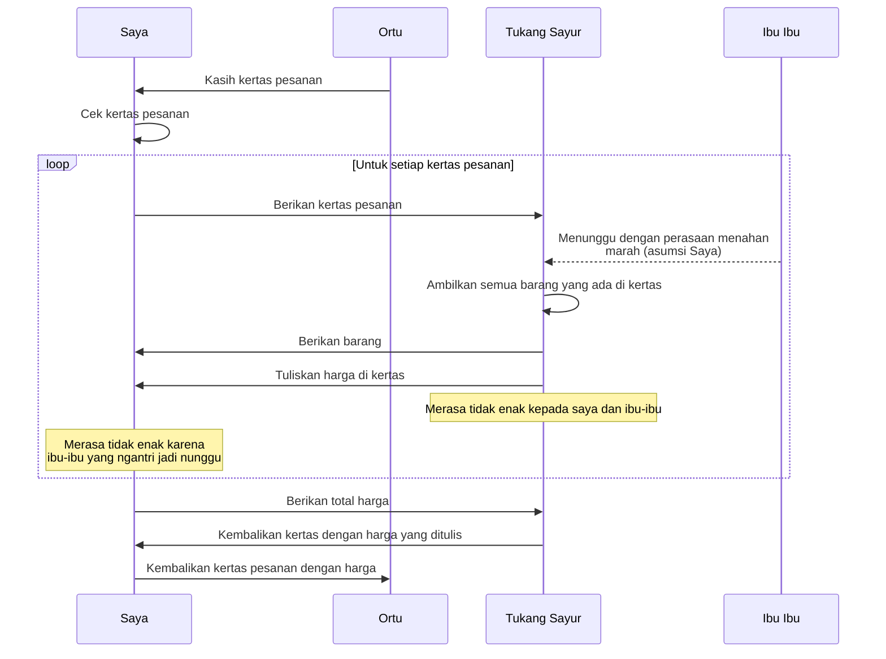

### Optimize logistic

Dari sisi customer sebenarnya. Awal mula Swalayand. Waktu itu covid. 2021.

Saya dikasih kertas isinya pesanan. Kadang kertas ini gak cuma satu. Misal wortel harus dibeli di tukang sayur A. Karena asumsinya wortel lebih segar di situ. Ikan di tempat B.

Kertas ini saya kasih ke tukang sayur. Proses setelahnya persis seperti yang dituliskan di atas.

**Tl;dr: semua pihak saling merasa gak enak.**

Saya merasa gak enak. Karena ibu-ibu yang ngantri menunggu dengan perasaan menahan marah. Karena saya menuntut tukang sayur menuliskan harga-harga di kertas yang saya bawa.

Ibu-ibu yang ngantri juga gak enak. Karena saya mengambil waktu tukang sayur terlalu lama.

Si pelayan toko juga sepertinya jadi merasa gak enak. Kepada dua pihak lainnya: saya dan semua ibu-ibu yang menahan marah itu. Karena memuaskan sebanyak mungkin orang adalah karakter pedagang.

Kenapa semua jadi ribet? Karena ini permintaan ortu. Dia punya alasannya sendiri. Tapi yang jelas saya jadi gak bisa pulang tanpa harga-harga itu selesai ditulis dan dijumlahkan.

Dari situlah ide Swalayand: otomasi proses ribet di atas. Pakai timbangan. Karena itu teknologi yang sudah dipakai, sehingga bisa dimulai dari situ.

Saya mulai beli timbangan yang persis dengan punyanya tukang sayur. [Bentuk percontohan barangnya](https://github.com/Swalayand/catetin/blob/main/images/photo_2021-07-05_14-14-28.jpg) seperti ini. Hanya bisa nampilin semua angka yang ada di timbangan.

Lalu 2023. Saya pulang kampung. Terjadi obrolan kira-kira "Gimana kabar cabai?"

"Iki tonggo-tonggo mari ngguaki cabe mas" (Temen-temen di sini baru aja buang cabai). "Lagi jatuh harganya. Terlalu banyak pasokan. Soalnya luar jawa juga masuk ke jawa. Jadi kalaupun dilanjutin/dikirim rugi. Lebih mahal." 

Ha? Ada ya orang gak dapet duit bukan karena gak punya barang.

Udah pernah denger sih. Dari teori marketing dan bisnis. Tapi mengalami langsung selalu lebih berkesan. Apalagi waktu itu. Ide Swalayand udah mengendap dua tahun. 

Dari situ kepikir: ngumpulin data. 
