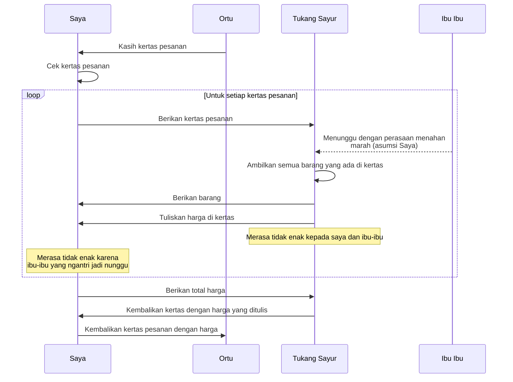

#### **Tl;dr semua pihak saling merasa gak enak.**

#### Solusi: 

Komponen:
1. [Precio 3a Scale](https://www.tokopedia.com/search?st=&q=3A%20Scale%20Timbangan%20Digital%20precio&srp_component_id=02.01.00.00&srp_page_id=&srp_page_title=&navsource=)
2. [sniffrr](https://github.com/Swalayand/sniffrr)

Baca [di sini](https://docs.google.com/document/d/18hRJtzPNbdbdG6hcYwAB81uORbHmQXsep5LHddbixRM/edit?usp=sharing) untuk mengetahui latar belakang.

#### Terimakasih

Terimakasih [@mamangopik](https://github.com/mamangopik/), [@faaiz282](https://github.com/faaiz282), Fauzan Askarillah dan semua orang yang mau membersamai saya dalam proses awal yang sulit.
