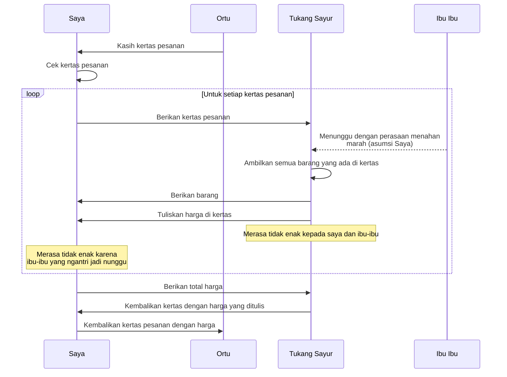

### Optimize logistic
#### Dari sisi pelanggan

Iya. Dari sisi customer sebenarnya. Awal mula Swalayand. Waktu itu covid. 2021.

Saya dikasih kertas isinya pesanan. Kadang kertas ini gak cuma satu. Misal wortel harus dibeli di tukang sayur A. Karena asumsinya wortel lebih segar di situ. Ikan di tempat B.

Kertas ini saya kasih ke tukang sayur. Proses setelahnya persis seperti diagram di atas.

**Tl;dr semua pihak saling merasa gak enak.**

Saya merasa gak enak. Karena ibu-ibu yang ngantri nunggu dengan perasaan nahan marah. Karena saya menuntut tukang sayur nulis harga-harga di kertas yang saya bawa.

Ibu-ibu yang ngantri juga gak enak. Karena saya ngambil waktu tukang sayur terlalu lama.

Si pelayan toko juga kayaknya jadi merasa gak enak. Ke dua pihak lainnya: saya dan semua ibu-ibu yang nahan marah itu. Karena memuaskan sebanyak mungkin orang adalah karakter pedagang.

Kenapa semua jadi ribet? Karena ini permintaan ortu. Dia punya alasannya sendiri. Tapi yang jelas saya jadi gak bisa pulang tanpa harga-harga itu selesai ditulis dan dijumlahkan.

Dari situlah ide Swalayand: otomatisasi proses ribet di atas. Pakai timbangan. Karena itu teknologi yang sudah dipakai, sehingga bisa dimulai dari situ.

Saya mulai beli timbangan yang persis dengan punyanya tukang sayur. Bentuk percontohan barangnya [seperti ini](https://github.com/Swalayand/catetin/blob/main/images/photo_2021-07-05_14-14-28.jpg). Hanya bisa nampilin semua angka yang ada di timbangan. Itulah kenapa namannya Catetin.

#### Keuntungan untuk produsen

Lalu 2023. Covid sudah mulai reda. Saya pulang kampung. Terjadi obrolan kira-kira "Gimana kabar cabai?"

"Iki tonggo-tonggo mari ngguaki cabe mas" (Teman-teman di sini baru aja buang cabai). "Lagi jatuh harganya. Terlalu banyak pasokan. Yang dari luar jawa juga masuk ke jawa. Jadi kalaupun dilanjutin/dikirim rugi. Lebih mahal." 

Ha? Ada ya orang gak dapet duit bukan karena gak punya barang.

Sudah pernah dengar sih. Dari teori marketing dan bisnis. Tapi mengalami langsung selalu lebih berkesan. Apalagi waktu itu. Ide Swalayand sudah mengendap dua tahun. 

Dari situ kepikir: ngumpulin data. Untuk membantu produsen merencanakan proses _end-to-end_ dengan lebih tepat. 

Karena makin tidak tepat produsen berarti ada logistik yang harusnya nganterin barang tapi jadi diam. 

Sekarang Catetin bukan bisa ngirim angka yang ada di timbangan. 

Walaupun masih perlu proses tambahan untuk bisa tahu itu wortel atau sawi. Memang. Tapi gambaran bisnis sudah ada.

#### Keuntungan untuk entrepreneur 

Kenapa [hardware]() dan [softwarenya]() open-source? Kenapa gak softwarenya saja open-source, dan memonetisasi penjualan hardware?

Karena walaupun ada yang bisa diperbaiki, proses yang ada sekarang sudah benar. Yang diperlukan adalah optimasi. Supaya semua tetap untung. Jadi paling baik diserahkan kepada yang berpengalaman. Dan saya tidak bisa menjangkau orang yang berpengalaman itu satu demi satu. 

Saya pribadi menahan diri. Pun sampai sekarang. Untuk memasukkan Swalayand dalam lomba atau _business pitch_. (Lomba IoT, hackathon, dan semacamnya). Karena saya hidup di dunia moderen. Satu yang bagus dari dunia moderen: mayoritas orang pengen kaya.

Tapi kayak-kayaknya mayoritas juga salah paham (buktinya yang kaya masih bukan mayoritas): Mereka ingin memperkaya diri sendiri. Padahal cara terbaik jadi kaya adalah dengan membuat dunia jadi sangat-sangat-sangat kaya. 

Bukan cuma gitu. Mereka pengen BANGET. Jadinya malah menyiksa diri sendiri: buru-buru. Padahal sekaya-kayanya Sandi Uno sekarang, gak bisa buka Traveloka pesan Spacex buat nginep di Mars. Jadi gak terlalu berguna jadi orang kaya SEKARANG BANGET. (Bagus ada orang-orang semacam Elon Musk yang ngerti konsep ini).

Dan membuat dunia jadi sangat kaya itu strategi yang sukses. Lihat Joyoboyo. Dia aja cuma meramal "Tanah jawa kalungan wesi" (tanah jawa bakal ada kalung besinya / kereta). Tapi sesakti-saktinya dia di jaman 1135 gak bisa beli tiket kereta cepat Bandung dengan harga 250k pake Android di layar silicon 6,8 inci.

Jadi semoga ada anak SMK atau SMA desa mana yang melanjutkan ide Swalayand ini. Bekerja sama dengan pamannya yang petani. Juga dengan tetangganya yang tukang sayur. 

Karena untuk membuat dunia menjadi kaya salah satunya adalah tidak membuang sumber daya. 

#### Syarat sukses Swalayand

1. Makin tersebar di banyak daerah makin bagus. Antar desa bagus. Antar kabupaten makin bagus. Antar pulau makin-makin bagus.
2. Mengikuti namanya Swalayan + daemon. Harusnya customer gak perlu mengantri. Jadi satu toko ada beberapa timbangan. Dia bisa ambil barang sendiri. Melayani dirinya sendiri sampai keluar toko. Tapi ini perlu dipastikan supaya timbangan tidak bisa dicurangi.
3. _Subscription-based_ untuk data. **Ini poin yang akan diupdate.**

#### Langkah selanjutnya

Saya akan bikin lapak sendiri. Kalau waktu mengijinkan. Eksperimen: bizpro dan teknologi seperti apa yang paling optimal.

#### Terimakasih

Terimakasih [@mamangopik](https://github.com/mamangopik/), Faaiz Ahsan, Fauzan Askarillah dan semua orang yang mau membersamai saya dalam proses awal yang sulit.
